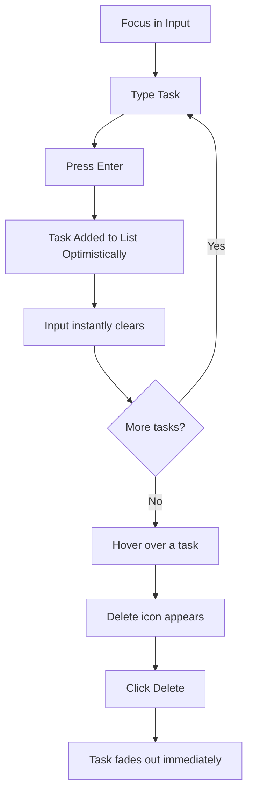

# UX Design Specification bmad-todo

**Author:** Giorgio
**Date:** April 28, 2026

---

<!-- UX design content will be appended sequentially through collaborative workflow steps -->

## Executive Summary

### Project Vision

Deliver a robust, production-ready task management web application that serves as a high-quality technical showcase. The focus is on demonstrating architectural solidity, clean code, comprehensive testing, and seamless deployment rather than complex feature sets.

### Target Users

- **The Evaluator:** Technical reviewers looking for engineering rigor, test coverage, and clear architecture.
- **The Everyday User:** End-users expecting a fast, responsive, and accessible task management interface.
- **The Developer/Maintainer:** Contributors needing maintainable code, automated tests, and structured CI/CD infrastructure.

### Key Design Challenges

- **Showcasing Quality:** Making a standard utility application look and feel like a premium, senior-level product.
- **Accessibility Compliance:** Meeting baseline WCAG requirements and ensuring full keyboard navigation within a standard UI kit.
- **Feedback Mechanisms:** Designing clear, immediate visual feedback for all CRUD operations to demonstrate system reliability.

### Design Opportunities

- **Perceived Performance:** Optimizing interactions to feel instant, showcasing the tight integration between the React frontend and Fastify backend.
- **Immediate Credibility:** Using a cohesive, modern visual language to instantly establish trust and technical competence with evaluators.

## Core User Experience

### Defining Experience

The core action is the standard CRUD cycle of managing a task: creating it instantly, checking it off effortlessly, and editing or deleting it without friction. Nailing these basic interactions is paramount; the interface must feel fluid and native to prove the robustness of the underlying Fastify/SQLite architecture.

### Platform Strategy

- **Platform Setup:** A React Single Page Application (SPA), accessed via modern desktop and mobile browsers.
- **Interaction Constraints:** It must be fully operable using a mouse, touch, and—crucially for our evaluator persona—keyboard navigation.
- **Implementation Constraint:** It strictly relies on an API connection (Fastify), meaning all loading, error, and success states from network requests must be handled gracefully in the UI.

### Effortless Interactions

- **Instant Task Creation:** Pressing "Enter" in the input field should add the task instantly to the list beneath it.
- **Keyboard Navigation:** Tabbing through tasks to check them off or delete them must be fully supported and clearly indicated visually.
- **Zero-Latency Feel:** Though API calls happen in the background, optimistic UI updates or extremely fast network responses should make the app feel like a local native application.

### Critical Success Moments

- **The "It Just Works" Moment:** For the technical evaluator, the first time they run the app locally and create/delete a task without a single console error or latency hiccup.
- **The "Accessible" Moment:** When an evaluator uses the `Tab` key to interact with the app, demonstrating the developer's attention to professional web standards.

### Experience Principles

- **Predictable & Familiar:** Use established design patterns (via a UI Kit) so the user spends zero time learning how to use the app and 100% of their time evaluating its quality.
- **Responsive & Communicative:** Every action must have an equal and opposite visual reaction (e.g., hover states, success toasts, loading states).
- **Accessible by Default:** Keyboard navigability and contrast ratios aren't afterthoughts; they are built in from step one.

## Desired Emotional Response

### Primary Emotional Goals

- **Professional Trust:** The user (evaluator) should immediately feel they are looking at code and a product built by a senior, competent engineer.
- **Effortless Control:** The end-user should feel completely unburdened; the tool should simply get out of their way.

### Emotional Journey Mapping

- **First Impression (On Load):** Reassurance. The clean, un-cluttered UI signals that the developer understands modern design aesthetics and restraint.
- **Core Interaction (CRUD):** Satisfaction. The instantaneous response to adding or checking off a task provides a mini-hit of dopamine and confirms the system's performance.
- **Deep Dive (Eval):** Respect. When the evaluator uses the keyboard to navigate or inspects the accessibility tags, they feel respect for the developer's attention to detail.

### Micro-Emotions

- **Confidence vs. Confusion:** Clean layouts and standard UI patterns eliminate any confusion about how to use the app, breeding confidence in the tool.
- **Delight vs. Frustration:** Zero loading spinners for optimistic updates create subtle delight, whereas waiting would cause frustration.

### Design Implications

- **Professional Trust →** Use a recognized, high-quality UI Kit capable of rendering crisp, modern components (e.g., Radix UI, MUI, or similar) rather than hand-rolling CSS that might look slightly off.
- **Effortless Control →** Minimize clicks. The input field should always be readily accessible, and checking off a task should be a single-click or single-keystroke action.

### Emotional Design Principles

- **Show, Don't Tell:** Prove the app's quality through its snap and responsiveness rather than complex onboarding.
- **Restraint is Premium:** Avoid unnecessary animations or "clever" UX patterns. A boring but perfectly executed pattern is better than a unique but flawed one.

## UX Pattern Analysis & Inspiration

### Inspiring Products Analysis

- **Linear:** The ultimate benchmark for high-performance, keyboard-first web applications. Linear's interface gets out of the way, updating instantly and using subtle, crisp visual design to establish engineering authority.
- **Apple Reminders:** The baseline for native, straightforward to-do functionality. It proves that a list of items with checkboxes and a simple input field at the bottom (or top) is the undisputed champion layout for managing tasks.
- **Vercel / Tailwind UIs:** These represent the current standard for "developer-focused SaaS." They use stark contrasts, tight typography, and monochromatic color palettes with subtle glowing accents to signify modern, high-quality engineering.

### Transferable UX Patterns

- **The "Always Ready" Input:** Taking a page from chat applications and advanced to-do lists, the primary entry field should always be visible and easily focusable, avoiding the need to click an "Add Task" button first.
- **Hover Reveal:** To keep the UI clean, secondary actions (like a "Delete" icon) only appear when the user hovers over a specific task row (or focuses it via keyboard).
- **Strikethrough & Dim:** When a task is marked complete, immediately striking through the text and lowering its opacity clearly separates active work from finished work without changing the core layout.

### Anti-Patterns to Avoid

- **The Modal Trap:** Requiring the user to open a modal or a separate page just to create or edit a simple task adds unnecessary friction and hides the core application state.
- **Loading Spinners for Micro-Interactions:** Showing a blocking spinner when a user checks a box breaks the flow. The UI should update optimistically.
- **Overly "Fun" Aesthetics:** Using bouncy animations, excessive bright colors, or quirky illustrations distracts the technical reviewer from the core focus: the underlying engineering quality and speed.

### Design Inspiration Strategy

**What to Adopt:**

- **Monochromatic/High-Contrast UI:** Adopt a clean, minimal interface (often dark mode by default or highly polished light mode) to signal "developer tool" aesthetics.
- **Keyboard Supremacy:** Ensure every critical action can be accomplished without touching the mouse, inspired by tools like Linear.

**What to Adapt:**

- **Standardized UI Kits:** Instead of custom-building every pixel like Linear does, rely on a robust UI kit (like Radix UI primitives or shadcn/ui) to achieve a similar look with less risk of accessibility failures.

**What to Avoid:**

- **Gamification:** No confetti when a task is completed. The satisfaction comes from the speed and reliability of the interaction, not artificial celebration.

## Design System Foundation

### 1.1 Design System Choice

**shadcn/ui (Radix UI Primitives + Tailwind CSS)**
We will use shadcn/ui. This is not a traditional component library you install via a single NPM package, but rather a collection of highly polished, accessible components (built on Radix UI) that you copy and paste into your project and style with Tailwind CSS.

### Rationale for Selection

- **Engineering Credibility:** Using headless UI primitives demonstrates an advanced understanding of modern React ecosystems, far more so than dropping in a heavy, pre-styled library like Material UI.
- **Flawless Accessibility:** Radix UI handles all the complex ARIA attributes, keyboard navigation, and focus management out of the box, instantly fulfilling our strict accessibility requirements.
- **Zero-Bloat Customization:** Because the components are copied directly into the codebase, we only ship the exact code we use. Tailwind CSS ensures the styles are minimal, fast, and easily adjustable to fit our monochromatic, high-contrast aesthetic.

### Implementation Approach

- Initialize Tailwind CSS in the React application.
- Install `lucide-react` for crisp, standard iconography.
- Use the shadcn/ui CLI to bootstrap the theme and add only the necessary components (e.g., `Button`, `Input`, `Checkbox`).
- Wrap the core task list in a semantic HTML `<ul>`/`<li>` structure, utilizing the accessible UI primitives for the interactive bits.

### Customization Strategy

- **Theme:** Establish a strict, high-contrast monochrome theme in Tailwind's configuration (using CSS variables generated by shadcn).
- **Animations:** Keep transitions ultra-fast (e.g., `duration-150`, `duration-200`) to emphasize the "zero-latency" feel requested in the emotional design goals. No bouncy or lingering animations.

## 2. Core User Experience

### 2.1 Defining Experience

**Frictionless Task Entry & Robust List Manipulation**
The defining interaction of bmad-todo is the absolute absence of friction when adding or checking off a task. It must feel like typing in a perfectly responsive native text editor, with the system handling all network latency seamlessly behind the scenes.

### 2.2 User Mental Model

Users bring a straightforward mental model to to-do lists: "I write an item, it appears on a list, I check a box when done."

- **The Expectation:** It should be as fast as writing on a piece of paper.
- **The Frustration:** Waiting for a server to respond before the item appears on the list, or dealing with clunky modals just to edit text.

### 2.3 Success Criteria

- **The Zero-Click Add:** A user can load the app and immediately start typing a task without having to click into an input field first (autofocus on load).
- **The Instant Strike:** Checking the checkbox instantly strikes through the text and dims it, with no perceptible delay, even while the API call is inflight.
- **Keyboard Mastery:** A user can `Tab` to a task, hit `Space` to check it off, and `Shift+Tab` back to the input field without touching the mouse.

### 2.4 Novel UX Patterns

Given the goal is a technical showcase, we are strictly adopting **established** UX patterns executed flawlessly.

- **No reinvention:** The checkbox is on the left, the text is in the middle, and the delete action is on the right (revealed on hover/focus).
- **The Innovation:** The "innovation" here is the execution—implementing optimistic UI updates so the standard pattern feels magical because it is never interrupted by a loading state.

### 2.5 Experience Mechanics

**1. Initiation (Adding a Task):**

- The user focuses on the main input field (autofocused on page load).
- They type their task and press the `Enter` key.
- _Feedback:_ The input clears instantly, and the task immediately slides into the list below.

**2. Interaction (Completing a Task):**

- The user clicks the checkbox (or focuses it and presses `Space`).
- _Feedback:_ The checkbox fills with a checkmark, the text receives a `line-through` style, and the opacity drops to `50%`. This happens instantaneously.

**3. Interaction (Deleting a Task):**

- The user hovers over a task row (or tabs to the hidden delete button).
- The "Delete" icon (trash can) appears on the far right of the row.
- The user clicks it.
- _Feedback:_ The row fades out or shrinks away immediately, removing it from the list.

**4. Completion:**

- Real-time interaction completes instantly from the user's perspective, while the React query/mutation handles the actual API resolution in the background. If the API fails, a subtle error toast informs the user and the state is reverted.

## Visual Design Foundation

### Color System

To emphasize the "technical showcase" and developer-centric nature of the application, we will avoid vibrant, playful colors in favor of a strict, high-contrast monochrome palette.

- **Primary Scale:** Tailwind's `Zinc` or `Slate` neutral scale. This provides a slightly cooler, modern gray footprint.
- **Brand/Accent:** The application will use true Black (`#000000`) or true White (`#FFFFFF`) as the primary accent color depending on the theme (Light/Dark mode).
- **Semantic Colors:**
  - _Success:_ Mild green (`emerald-600`) reserved ONLY for actual success toasts, not for the standard checkbox interaction.
  - _Destructive:_ Subtle red (`red-600`) used exclusively for the delete action hover state.

### Typography System

The typography must be perfectly legible, geometric, and look native to modern operating systems.

- **Primary Typeface:** `Inter` (or the system default `ui-sans-serif`). It is the industry standard for modern SaaS and developer tools, ensuring the UI looks instantly familiar and highly legible.
- **Type Scale:**
  - Standard base size of `16px` (`text-base`) for optimal readability on all devices.
  - Tight tracking (letter-spacing) on headings (`tracking-tight`) to create a compact, engineered look.
- **Hierarchy:** Rely on font-weight (e.g., `font-medium` vs. `font-normal`) and color contrast (e.g., `text-zinc-900` vs. `text-zinc-500`) rather than drastic size differences to maintain a tidy list UI.

### Spacing & Layout Foundation

- **The Grid System:** A strict `4px`/`8px` baseline grid, powered entirely by Tailwind's default spacing scale (`p-2`, `p-4`, `gap-2`, etc.).
- **Density:** The layout should land in the "Comfortable" to "Compact" range. Because it is a utility application (a to-do list), users need to see maximum information without feeling cramped. Use `gap-3` (12px) or `gap-4` (16px) between task items.
- **Centering:** The core application will be constrained to a maximum width (e.g., `max-w-2xl` or `max-w-3xl`) and centered on the screen, creating a focused, distraction-free environment.

### Accessibility Considerations

- **Contrast Ratios:** By strictly adhering to Tailwind's `zinc-900` on `white` (or `zinc-50` on `zinc-950`), text strings will naturally pass WCAG AA (and often AAA) contrast checks out of the box.
- **Focus Rings:** We will utilize highly visible, high-contrast focus rings (e.g., a solid 2px outline with an offset) on all interactive elements. This is non-negotiable for the Evaluator persona testing keyboard navigation.

## Design Direction Decision

### Design Directions Explored

Given the precise intent of this technical showcase, we bypassed arbitrary colorful themes to focus on optimizing the standard "Developer Minimalist" layout. We considered:

1. **Full-width Dashboard:** Too complex and empty for a simple to-do application.
2. **Card-based Grid:** Unnecessary cognitive overhead for sequential task execution.
3. **Centered Single-Column (Chosen):** The industry standard for focused, linear data processing.

### Chosen Direction

**The "Developer Minimalist" Centered Column**
The interface will be composed of a single, narrow, horizontally-centered column (e.g., `max-w-2xl`).

- The Top: A simple typographic header specifying the project name and perhaps a brief "Technical Showcase" badge.
- The Middle: The main input field, flush with the task list.
- The Bottom: The vertically stacked list of tasks, separated by subtle borders (1px solid `zinc-200` or `zinc-800`).

### Design Rationale

- **Focus:** A narrow column prevents the user's eyes from having to track across a wide screen, keeping all interactions tight and mouse travel distance low.
- **Familiarity:** This layout mirrors the command line terminal, the code editor, and standard note-taking apps—environments where our Evaluator persona feels most at home.

### Implementation Approach

- Use a primary `<main>` container with `max-w-2xl mx-auto mt-12 md:mt-24 px-4`.
- Apply a subtle shadow or ring to the main task container to lift it slightly off the background (e.g., `shadow-sm ring-1 ring-zinc-900/5`).
- Ensure the background utilizes a very subtle off-white/gray (e.g., `bg-zinc-50`) in light mode so the true-white task cards pop slightly.

## User Journey Flows

### 1. The Evaluator Journey (First Impression & Testing)

This journey focuses on the technical reviewer experiencing the application for the very first time. Their goal is to quickly ascertain quality and robustness.

```mermaid
graph TD
    A[Launch App via Docker] --> B{App Loads?};
    B -- Yes --> C[View Empty State/Task List];
    C --> D[Add Test Task via Keyboard];
    D --> E{API Responds Fast?};
    E -- Yes --> F[Action: Hit Tab Key];
    F --> G[Focus shifts to Checkbox showing clear outline];
    G --> H[Action: Hit Spacebar];
    H --> I[Task immediately strikes through];
    I --> J[Evaluator Sentiment: "This is well built"];
```

### 2. The Everyday User Journey (CRUD Loop)

This journey focuses on the theoretical end-user rapidly managing a list of items.



### Journey Patterns

- **The Optimistic Loop:** Action -> Immediate UI Feedback -> Background API Call. The user is never blocked from taking their next action while waiting for the server.
- **Progressive Disclosure:** UI elements like the "Delete" button are hidden by default to maintain the clean "Developer Minimalist" aesthetic, revealing themselves strictly on hover or keyboard focus.

### Flow Optimization Principles

- **Zero Mouse Dependency:** Every single action in the CRUD loop must be executable without moving the hands away from the home row of the keyboard.
- **Instant Reset:** After submitting a task, the input field must instantly clear and remain focused, primed for the next entry.

## Component Strategy

### Design System Components

We will pull the following primitive components from shadcn/ui to serve as our foundation:

- **`Input`:** The standard styled text input field for adding/editing tasks.
- **`Checkbox`:** The accessible, keyboard-navigable checkbox primitive.
- **`Button`:** Specifically using the `ghost` or `icon` variants for the delete action to keep the UI clean.
- **`Toast` / `Toaster`:** For displaying subtle, transient error messages if network requests fail.

### Custom Components

Since the application is highly focused, we only need to assemble one primary custom component: **The Task Row (`TaskItem`)**.

### `TaskItem` Component Specification

**Purpose:** To display a single task, allow the user to toggle its completion state, and provide a way to delete it.
**Usage:** Rendered within a list container (`<ul role="list">`) for each task returned by the API.
**Anatomy:**

- _Left:_ Checkbox (`shadcn/ui`)
- _Center:_ Task text (`span` or `label` linked to the checkbox)
- _Right:_ Delete Button (icon only, hidden by default)
  **States:**
- _Default:_ Standard text color, unchecked box, hidden delete button.
- _Hover/Focus-within:_ Delete button becomes visible (`opacity-100`).
- _Completed:_ Checkbox checked, text receives `line-through` and `opacity-50`.
- _Mutating (Optimistic):_ Instantly reflects the target state while the network request resolves in the background.

### Component Implementation Strategy

Keep the component tree exceptionally flat. The `TaskItem` should be a "dumb" presentation component that receives the task data and callback functions (`onToggle`, `onDelete`) via props. This allows the parent container to manage the optimistic state updates and network requests centrally.

### Implementation Roadmap

**Phase 1 - Core Assembly:**

- Install shadcn/ui primitives.
- Build the main centered layout container and static typography.
- Implement the primary `Input` field at the top.

**Phase 2 - The Task List:**

- Build the `TaskItem` component incorporating the checkbox and styling states.
- Render a static list of mock tasks to ensure styling and hover states are perfect before connecting the API.

**Phase 3 - Polish:**

- Wire up the optimistic UI updates.
- Ensure perfect `Tab` indexing between the main input and the task rows.
- Integrate the `Toast` component for error boundaries.

## UX Consistency Patterns

### Feedback Patterns

- **Optimistic Execution:** All direct user actions (add, check, delete) execute immediately on the UI. We do not use loading spinners for these micro-interactions.
- **Silent Success:** If an optimistic update resolves successfully with the API, the UI does _nothing_. No "Task Saved!" toasts. The lack of interruption is the reward.
- **Loud Failure:** If an optimistic update fails (e.g., SQLite lock, network error), the UI immediately reverts to its previous state and a high-contrast Toast notification appears explaining the error clearly.

### State Patterns

- **Empty State:** When 0 tasks exist, the list area displays a subtle, centered, muted text message (e.g., "No tasks yet. Press Enter above to create one."). Avoid "cute" illustrations.
- **Focused State:** The currently active interactive element must strictly utilize the Tailwind `focus-visible:ring` utilities to show a crisp 2px offset border, proving the app is fully keyboard operable.

### Button & Interaction Hierarchy

- **Primary Action (Invisible):** The primary submit action is the `Enter` key on the input field. There is no visual "Submit" button taking up space.
- **Secondary Action (Task Check):** The checkbox is always visible on the left side of the task.
- **Destructive Action (Hover/Focus-Reveal):** The "Delete" trash icon only appears when the user is actively interacting with the specific task row. This keeps the global UI clean while ensuring the destructive action is contextually proximate.

### Error Handling

- **Input Validation:** The only validation needed is preventing blank submissions. If the user hits enter on an empty field, nothing happens (no error toast, just a silent block).
- **Graceful Degradation:** If the FastAPI backend is completely unreachable, the frontend must detect this and show a global warning state, preventing the user from entering tasks that will inevitably fail.

## Responsive Design & Accessibility

### Responsive Strategy

Given the "Developer Minimalist" single-column layout, the responsive strategy is extremely straightforward:

- **Mobile (Default):** The main container spans the full width of the screen, minus a standard padding (e.g., `w-full px-4`). Touch targets (checkboxes, delete buttons) must be large enough to easily tap (minimum 44x44px hit area).
- **Tablet & Desktop:** The main container stops growing at a maximum width (`max-w-2xl`) and centers itself exactly in the middle of the screen horizontally.

### Breakpoint Strategy

We will utilize standard Tailwind CSS breakpoints, focusing primarily on the transition from mobile to desktop.

- **`< 640px` (Mobile):** Delete buttons should always be visible (since there is no "hover" state on touch devices) or accessible via a swipe gesture.
- **`>= 640px` (sm - Desktop):** Hover states engage. Delete icons hide until hovered or focused.

### Accessibility Strategy

We are aiming for a robust **WCAG AA** baseline, proving the application is production-ready.

- **Semantic HTML:** The task list must be an unordered list (`<ul role="list">`) and each task a list item (`<li>`).
- **Forms:** The input must have a `<label>` (which can be visually hidden using `sr-only` if necessary, though a placeholder is an acceptable fallback for a single-input app).
- **Checkboxes:** Real `<button role="checkbox">` or `<input type="checkbox">` primitives provided by shadcn/ui to handle `aria-checked` states natively.
- **Color Contrast:** Text-to-background contrast must exceed 4.5:1. The chosen Tailwind Zinc scale guarantees this.

### Testing Strategy

- **Automated:** Rely on the `axe-core` library or Lighthouse integrated into the E2E testing suite (e.g., Playwright or Cypress) to guarantee zero critical accessibility violations.
- **Manual (The Evaluator Test):** Unplug the mouse. The developer must be able to load the app, add 3 tasks, check 2 off, and delete 1 using _only_ the `Tab`, `Shift+Tab`, `Space`, and `Enter` keys.

### Implementation Guidelines

- **Focus Management:** When a task is deleted via keyboard, focus must intelligently jump to the next logical element (e.g., the next task or back to the main input) rather than dropping to the document `body`.
- **Screen Readers:** Ensure dynamic states (like when a task is optimistically checked) use `aria-live="polite"` regions so screen readers announce the state change without requiring a page reload.
